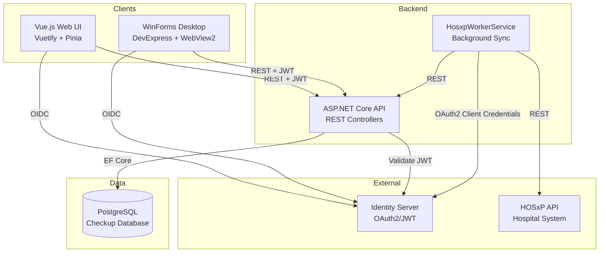
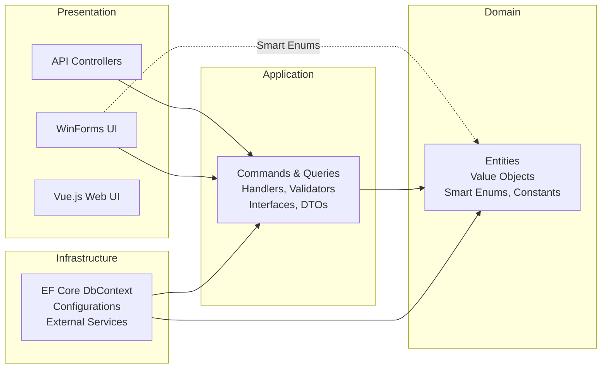
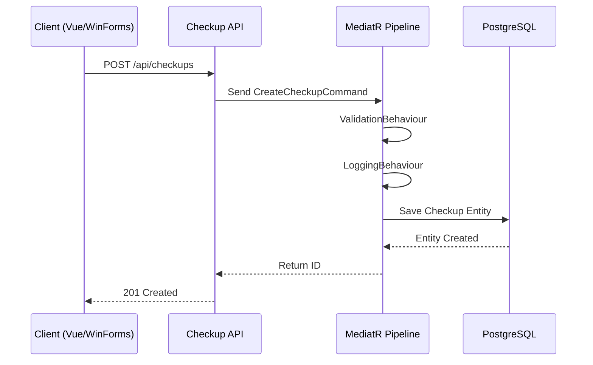
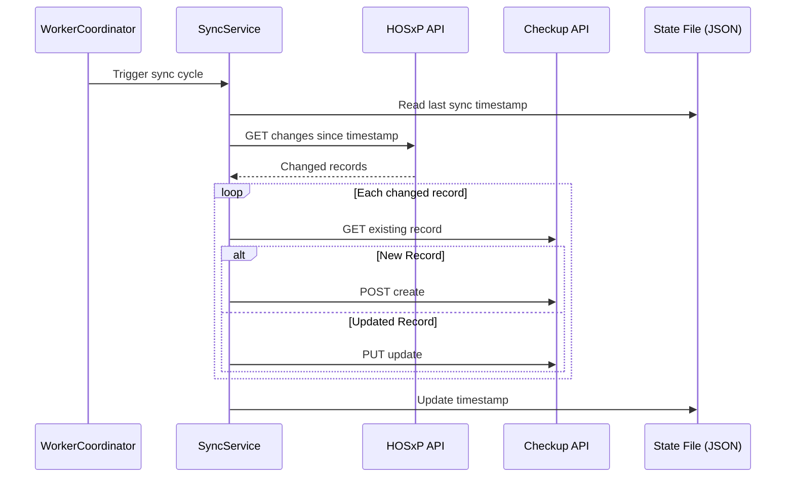

# System Architecture

## Overview
SUTH Checkup follows **Clean Architecture** with **CQRS** (Command Query Responsibility Segregation) pattern. The system comprises multiple deployment units communicating through REST APIs and shared database access.

## Architecture Diagram

## Clean Architecture Layers

**Dependency Rule:** Dependencies point inward. Domain has zero external dependencies. Application depends only on Domain. Infrastructure implements Application interfaces.

## Major Modules

### 1. Domain (`src/Domain/`)
Pure business logic layer. Contains entities, value objects, enums, and domain events. No framework dependencies except MediatR for domain events.

### 2. Application (`src/Application/`)
Use cases organized as **Features**. Each feature contains Commands (writes), Queries (reads), ViewModels (DTOs), and Validators. Uses MediatR pipeline with behaviors for cross-cutting concerns (validation, logging, performance, authorization).

### 3. Infrastructure (`src/Infrastructure/`)
Data access via EF Core with PostgreSQL. Contains DbContext, entity configurations, migrations, interceptors (audit trail), and external service implementations.

### 4. API (`src/API/`)
ASP.NET Core REST API. Controllers dispatch requests via MediatR. Includes JWT authentication, Swagger documentation, exception middleware, and CORS configuration.

### 5. HosxpWorkerService (`src/HosxpWorkerService/`)
Background service that polls HOSxP API for changes and syncs data into the Checkup database via the Checkup API. Handles: patients, checkup visits, lab results, x-ray results, and doctor/careprovider records.

### 6. WinFormsUI (`src/WinFormsUI/`)
Desktop client for power users (doctors/nurses). Provides detailed checkup forms, cumulative comparison views, and DevExpress-based report printing. Directly references the Domain project for compile-time access to Smart Enums and localized display names.

### 7. Vue Web UI (`src/vuewebui/`)
Modern SPA built with Vue 3 + Vuetify 3. Provides dashboard views with OIDC authentication, i18n (EN/TH), and dark/light theming.

## Data Flow

### Checkup Creation Flow

### HOSxP Sync Flow

## Authentication & Authorization

- **Protocol:** OAuth2 / OpenID Connect
- **Provider:** Identity Server (Duende)
- **API Auth:** JWT Bearer tokens validated against Identity Server authority
- **Client Auth:** OIDC redirect flow (web), OIDC with WebView2 (desktop)
- **Worker Auth:** OAuth2 Client Credentials flow
- **Roles:** Doctor, Nurse, Admin, Employee
- **Policies:** RequireAuthenticatedUser, RequireDoctor, RequireNurse, RequireAdmin, RequireEmployee

> **Note:** Authorization enforcement in the MediatR pipeline (`AuthorizationBehaviour`) is currently disabled (commented out). See [known-issues.md](known-issues.md).

## External Services

| Service | Purpose | Integration |
|---------|---------|-------------|
| **Identity Server** | Authentication & authorization | JWT validation, OIDC flows |
| **HOSxP API** | Hospital Information System | REST API polling via Worker Service |
| **PostgreSQL** | Primary database | EF Core with Npgsql |
