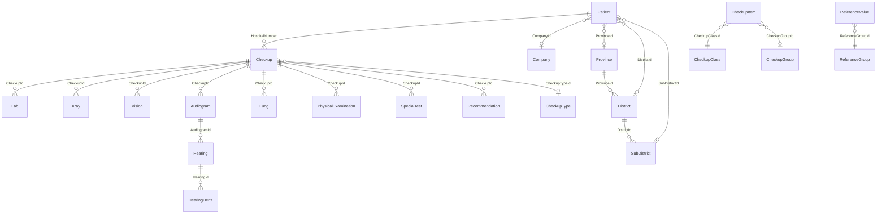

# Database Model

## Database Configuration

| Property | Value |
|----------|-------|
| **Database** | PostgreSQL |
| **ORM** | Entity Framework Core 9.0 (Npgsql) |
| **Approach** | Code-First with Migrations |
| **JSON Support** | Enabled via `NpgsqlDataSourceBuilder` |
| **Connection String Key** | `CheckupDatabase` |
| **Audit Trail** | Automatic via `AuditableEntitySaveChangesInterceptors` |

## Contexts

### 1. CheckupDatabaseContext (Primary)
Main application database. Implements `ICheckupDatabaseContext`. Contains all checkup-related tables.

### 2. HosxpDatabaseContext (External, Read-Only)
Connection to external HOSxP hospital system. Used for data synchronization queries.

## ER Diagram

## Main Entities

### Patient
| Column | Type | Notes |
|--------|------|-------|
| Id | int | PK, auto-increment |
| HospitalNumber | string | 8-digit HN, unique |
| Prefix | string | Title (Mr./Mrs./etc.) |
| FirstName | string | Thai first name |
| LastName | string | Thai last name |
| FirstNameEn | string | English first name |
| LastNameEn | string | English last name |
| Gender | string | "M" or "F" |
| BirthDate | DateTime? | Date of birth |
| Nationality | string | |
| Religion | string | |
| BloodGroup | string | Blood type |
| DrugAllergy | string | Known drug allergies |
| ChronicDisease | string | Known chronic diseases |
| CompanyId | int? | FK to Company |
| ProvinceId | int? | FK to Province |
| DistrictId | int? | FK to District |
| SubDistrictId | int? | FK to SubDistrict |
| *Audit fields* | | CreatedOn, LastModified, IsActive, DeleteFlag |

### Checkup
| Column | Type | Notes |
|--------|------|-------|
| Id | int | PK |
| VisitNumber | string | Unique visit identifier |
| HospitalNumber | string | Patient HN |
| VisitDate | DateTime? | Visit date/time |
| Weight | float? | kg |
| Height | float? | cm |
| Temperature | float? | Celsius |
| Pulse | int? | bpm |
| BloodPressure | string | Systolic/Diastolic |
| RespiratoryRate | int? | breaths/min |
| Waist | float? | cm |
| Hips | float? | cm |
| SmokingStatus | string | |
| AlcoholStatus | string | |
| CheckupTypeId | int? | FK to CheckupType |
| LabOrder | List<string> | JSON column |
| XrayOrder | List<string> | JSON column |
| ServiceOrder | List<string> | JSON column |
| FinalReport | FinalReport | JSON column (value object) |
| *Audit fields* | | CreatedOn, LastModified, IsActive, DeleteFlag |

### Lab
| Column | Type | Notes |
|--------|------|-------|
| Id | int | PK |
| CheckupId | int | FK to Checkup |
| LabItemCode | string | Lab test code |
| LabItemName | string | Lab test name |
| ResultValue | string | Test result |
| ReferenceRange | string | Normal range |
| AbnormalFlag | string | Y/N/H/L |
| Comments | string | Additional notes |
| ResultDate | DateTime? | When result was available |

### Xray
| Column | Type | Notes |
|--------|------|-------|
| Id | int | PK |
| CheckupId | int | FK to Checkup |
| ResultValue | string | X-ray finding |
| AbnormalFlag | string | Y/N |
| ResultReport | string | Report summary |
| ReportText | string | Full report (RTF from PACS) |
| AccessionNumber | string | PACS accession |

### Vision
| Column | Type | Notes |
|--------|------|-------|
| Id | int | PK |
| CheckupId | int | FK to Checkup |
| VaRightEye | string | Visual acuity right |
| VaLeftEye | string | Visual acuity left |
| PhRightEye | string | Pinhole right |
| PhLeftEye | string | Pinhole left |
| ColorBlindness | string | Color vision result |
| EyePressureRight | string | IOP right |
| EyePressureLeft | string | IOP left |
| Vision3D | string | Stereopsis |
| Squint | string | Strabismus |
| VisualField | string | Field test |
| Retina | string | Fundoscopy |

### Audiogram
| Column | Type | Notes |
|--------|------|-------|
| Id | int | PK |
| CheckupId | int | FK to Checkup |
| LeftResult | string | Left ear finding |
| RightResult | string | Right ear finding |
| LeftAbnormality | string | Left abnormality |
| RightAbnormality | string | Right abnormality |
| ResultNote | string | Summary |

### Hearing
| Column | Type | Notes |
|--------|------|-------|
| Id | int | PK |
| AudiogramId | int | FK to Audiogram |
| *frequency data* | | Left/right ear measurements |

### HearingHertz
| Column | Type | Notes |
|--------|------|-------|
| Id | int | PK |
| HearingId | int | FK to Hearing |
| *hertz-level data* | | Frequency-specific measurements |

### Lung
| Column | Type | Notes |
|--------|------|-------|
| Id | int | PK |
| CheckupId | int | FK to Checkup |
| FVC | LungValue | JSON (value + percentage) |
| FEV1 | LungValue | JSON (value + percentage) |
| Restriction | string | Restrictive pattern |
| Obstruction | string | Obstructive pattern |
| Combined | string | Combined pattern |
| Severity | string | Severity level |
| ConsultRecommend | string | Follow-up recommendation |

### PhysicalExamination
| Column | Type | Notes |
|--------|------|-------|
| Id | int | PK |
| CheckupId | int | FK to Checkup |
| GA | string | General Appearance |
| HEENT | string | Head, Eyes, Ears, Nose, Throat |
| Mouth | string | Oral exam |
| Lymph | string | Lymph nodes |
| Thyroid | string | Thyroid exam |
| Chest | string | Chest/lung exam |
| Heart | string | Cardiac exam |
| Abdomen | string | Abdominal exam |
| Ext | string | Extremities |
| Skin | string | Dermatological |
| Other | string | Additional findings |
| *Note fields* | string | Free-text notes per category |

### Reference Data Tables

| Entity | Purpose |
|--------|---------|
| Company | Patient employers (name, address) |
| CheckupType | Checkup program types |
| CheckupClass | Test classification |
| CheckupGroup | Display grouping |
| CheckupItem | Individual test items (code, name, sort, cumulative config) |
| ReferenceGroup | Lab reference groupings |
| ReferenceValue | Normal ranges (by age, gender) |
| Recommendation | Doctor recommendations |
| RecommendationTemplate | Reusable recommendation templates |
| Report | Generated health reports |
| Province | Thai provinces |
| District | Thai districts (FK to Province) |
| SubDistrict | Thai sub-districts (FK to District) |
| Careprovider | Healthcare professionals |

## Common Audit Fields (BaseEntity)

All entities inherit from `BaseEntity`:

| Column | Type | Notes |
|--------|------|-------|
| Id | int | Primary key, auto-increment |
| DeleteFlag | bool? | Soft delete marker |
| IsActive | bool | Active/inactive flag |
| CreatedOn | DateTimeOffset? | Auto-set on insert |
| LastModified | DateTimeOffset? | Auto-set on update |

## JSON Columns

PostgreSQL JSON support is used for complex nested data:
- `Checkup.LabOrder` — `List<string>`
- `Checkup.XrayOrder` — `List<string>`
- `Checkup.ServiceOrder` — `List<string>`
- `Checkup.FinalReport` — `FinalReport` value object
- `Lung.FVC`, `Lung.FEV1` — `LungValue` value objects

## Entity Configurations

Fluent API configurations in `Infrastructure/Persistence/Configurations/`:
- `PatientConfiguration` — HN uniqueness, indexes
- `CheckupConfiguration` — Visit number, JSON columns, relationships
- `AudiogramConfiguration` — Hearing relationship cascade
- `CareproviderConfiguration` — Code uniqueness
- `CheckupItemConfiguration` — Class/group relationships
- `ProvinceConfiguration`, `DistrictConfiguration`, `SubDistrictConfiguration` — Geographic hierarchy
- `RecommendationTemplateConfiguration` — Template setup
- `ReportConfiguration` — Report entity config

## Seed Data

Database seeding is handled via MediatR commands in `Application/Features/Systems/Commands/`:
- Thai province/district/sub-district data
- Checkup classes, groups, types, items
- Hearing hertz reference data
- Reference groups and values
- Recommendation templates
