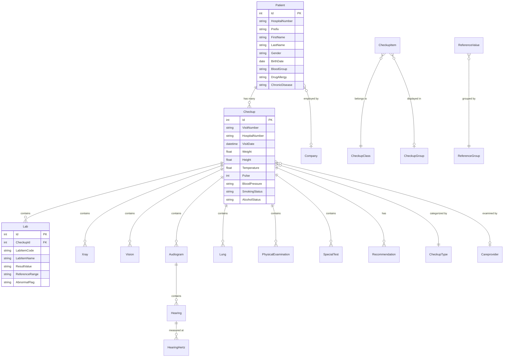

# Domain Model

## Core Domain: Health Checkup Management

The system manages the lifecycle of patient health checkups at a hospital, from patient registration through examination, testing, and final report generation.

## Domain Terminology

| Term | Meaning |
|------|---------|
| **Checkup** | A health checkup visit — the central aggregate containing all exam results |
| **HN (Hospital Number)** | Unique 8-digit patient identifier in the hospital system |
| **Visit Number** | Unique identifier for a specific checkup visit |
| **HOSxP** | External hospital information system (source of truth for patient/lab data) |
| **Careprovider** | A healthcare professional (doctor, nurse) involved in the checkup |
| **CheckupType** | Category of checkup program (e.g., annual, pre-employment) |
| **CheckupClass** | Classification grouping for checkup items |
| **CheckupGroup** | Display grouping for checkup items in reports |
| **CheckupItem** | An individual test/exam item within a checkup |
| **FinalReport** | Consolidated checkup results approved by a doctor |
| **Reference Value** | Normal range for a lab test based on age/gender |
| **Smart Enum** | Strongly-typed static lookup value defined in Domain (replaces magic strings and legacy ReferenceValue for dropdowns) |
| **Cumulative** | Comparison of results across multiple checkup visits over time |

## Core Entities & Relationships

## Entity Details

### Patient (Aggregate Root)
Represents a hospital patient. Synced from HOSxP. Key fields: HN, Thai/English names, demographics, medical history (allergies, chronic diseases), employer (Company).

### Checkup (Aggregate Root)
Central entity representing a checkup visit. Contains:
- **Visit metadata:** visit number, date/time, HN
- **Vital signs:** weight, height, temperature, pulse, BP, respiratory rate, waist, hips
- **Lifestyle:** smoking status, alcohol status
- **Orders:** LabOrder, XrayOrder, ServiceOrder (lists of ordered tests)
- **FinalReport:** Value object containing finalized lab and vision results
- **Child collections:** Labs, Xrays, Visions, Audiograms, Lungs, PhysicalExams, SpecialTests

### Lab
Laboratory test result. Contains item code/name, result value, reference range, abnormal flag (Y/N/H/L), comments, and result timestamp.

### Xray
X-ray imaging result. Contains result value, abnormal flag, report text (RTF from PACS), and accession number.

### Vision
Eye examination result. Includes visual acuity (both eyes), pinhole, color blindness, eye pressure, 3D vision, squint, visual field, and retina findings.

### Audiogram / Hearing / HearingHertz
Hearing test hierarchy. Audiogram contains Hearing entries (left/right), each with HearingHertz frequency measurements.

### Lung
Spirometry result. Contains FVC, FEV1 with percentages, abnormality types (restriction/obstruction/combined), severity levels, and consultation recommendation.

### PhysicalExamination
Systematic physical exam. Covers: GA (General Appearance), HEENT, Mouth, Lymph, Thyroid, Chest, Heart, Abdomen, Extremities, Skin. Each has coded result + free-text notes.

### Careprovider
Healthcare professional. Contains code (from HOSxP), names, license number, position, and type (doctor/nurse/etc).

### Company
Patient's employer organization. Contains company name, address, and location info.

### Reference Data Entities
- **CheckupType** — Checkup program categories
- **CheckupClass** — Test classification system
- **CheckupGroup** — Display grouping for reports
- **CheckupItem** — Individual test items with cumulative reporting config
- **ReferenceGroup / ReferenceValue** — Normal ranges for lab tests (legacy, see Smart Enums below)
- **RecommendationTemplate** — Reusable recommendation text
- **Province / District / SubDistrict** — Thai geographic reference data

### Smart Enums (Lookup Data)

Static lookup values are implemented as **Smart Enums** in `src/Domain/Common/SmartEnum.cs` -- strongly-typed objects that replace magic strings and provide compile-time safety. Each Smart Enum maps to a former `ReferenceGroup`/`ReferenceValue` pair.

| Smart Enum | File | Maps to ReferenceGroup | Values |
|------------|------|------------------------|--------|
| `ExamResult` | `src/Domain/Enums/ExamResult.cs` | GA (Id=1) | Normal, Abnormal, NotExamined |
| `LabResult` | `src/Domain/Enums/LabResult.cs` | LAB (Id=2) | Normal, Abnormal |
| `XrayResult` | `src/Domain/Enums/XrayResult.cs` | X (Id=3) | Normal, Abnormal, WaitForSpecialist |
| `BmdResult` | `src/Domain/Enums/BmdResult.cs` | BMD (Id=4) | Normal, OsteopeniaRisk, Osteoporosis |
| `AbiResult` | `src/Domain/Enums/AbiResult.cs` | ABI (Id=5) | Normal, Arteriosclerosis, Occlusion |
| `CheckupStatus` | `src/Domain/Enums/CheckupStatus.cs` | CKST (Id=6) | Pending, InProgress, Reported |
| `EyeResult` | `src/Domain/Enums/EyeResult.cs` | EYE (Id=8) | Normal, Farsighted, Nearsighted |
| `HearingLossLevel` | `src/Domain/Enums/HearingLossLevel.cs` | AU (Id=9) | Normal, Mild, Moderate, Severe, Profound |

**Key APIs:**
- `SmartEnum<T>.All` — All instances (ordered by Sort)
- `SmartEnum<T>.FromValue(string)` — Lookup by value
- `instance.Value` — The stable string key (e.g., `"Normal"`, `"Abnormal"`)
- `instance.DisplayName` — Thai display name (default)
- `instance.GetDisplayName("en")` — Localized display name via `.resx` files

**Multilingual support:** Each Smart Enum has `.resx` resource files in `src/Domain/Resources/` (Thai default + English). Adding a new language requires only creating new `.resx` files (e.g., `ExamResult.zh.resx` for Chinese) -- zero code changes.

**Coexistence:** The original `ReferenceGroup`/`ReferenceValue` tables and seed data remain intact for team evaluation. Smart Enums are an additive feature.

## Value Objects
- **Gender** — Male ("M"), Female ("F")
- **FinalReport** — Contains finalized FinalLab and FinalVision results
- **StatusFlag** — Y/N/H/L result flags
- **CareproviderType** — Doctor, Nurse, etc.
- **LungValue** — Lung measurement with value and percentage
- **Ear, Eye** — Biometric measurements
- **CompareRule** — Rules for cumulative data comparison

## Domain Workflows

### 1. New Checkup Registration
Patient arrives → Nurse creates checkup visit → Records vital signs → Orders labs/xrays → Patient proceeds to stations

### 2. Result Collection
Lab results arrive from HOSxP (via worker sync) → X-ray results arrive → Vision/hearing/lung tests entered manually → Physical exam performed by doctor

### 3. Report Finalization
Doctor reviews all results → Writes recommendations → Approves final report → Report available for printing/viewing

### 4. Background Sync (HOSxP)
Worker polls HOSxP periodically → Detects new/changed records → Creates/updates patients and checkup visits → Syncs lab and x-ray results → Updates careprovider master data
